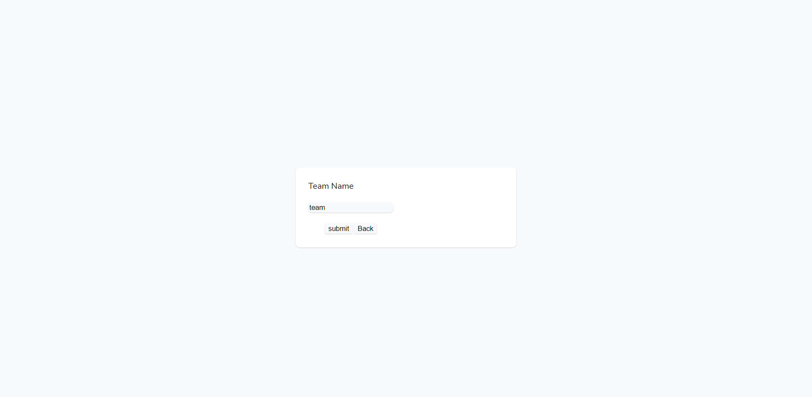

## About App

This mini app enables user to:
    1. create football team.
    2. create match and add match score.
    3. calculate and display ranking table of teams.

## Create Team Snapshots:
    1. write team name:

    2. submit team:

    3. team table after team submission:

## Create Match Snapshots:
    1. input match data:

    2. submit match:

    3. match table after match submission:

## Teams Ranking:

    teams table after match submission:
